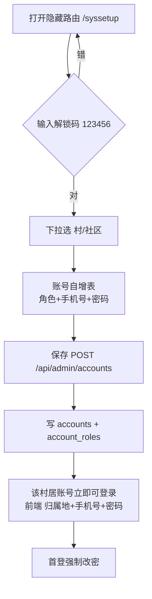
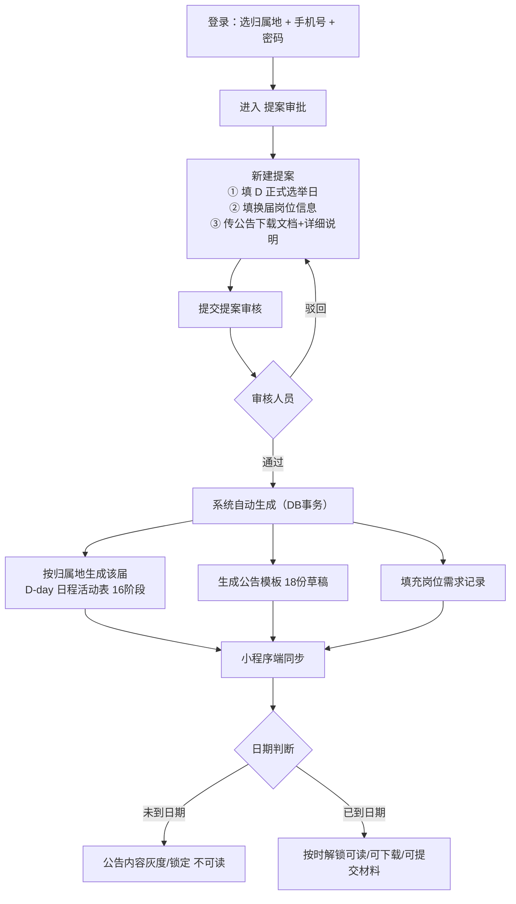

# 后台引导与账号管理设计 V1（2026-09-02）

> 本文回答夏夏本轮三件事：
> ①「小编工作台 ↔ 公告管理」重复功能的合并，现状核对 + 收尾清单
> ② 后台「气泡引导 + 隐藏解锁页 + 归属地账号预设」设计
> ③ 「选举怎么创建」全流程设计（登录 → 提案 → 审核 → 自动生成 → 小程序灰度解锁）
> 状态：**设计稿（待确认）**。与现有代码核对过，引用均标注文件:行号。

---

## 0. 结论速览

| 事项 | 结论 |
|---|---|
| 唯一性合并（两个真相） | **最新代码已落地**：公告记录=只读台账；小编工作台=唯一编辑器；每份公告独立附件。见 §1 |
| 小程序「切换公告下载链接是死的」 | 后端已改：每份公告各自目录/各自附件（`/api/announcements/:id/file`）。小程序端联动**待核查** |
| web liveSync 未覆盖的页 | 材料 / 候选人 / 归档 / 结果 四类**未灌真实数据**，可能仍显示 mock/本地，**待核查** |
| 后台气泡引导 | 新设计，见 §2 |
| 隐藏解锁页 + 归属地账号预设 | 新设计，见 §3（需新增一个后端写接口） |
| 选举创建流程 | 新设计，见 §4（底层 D-002 已实现，补登录引导与界面落地） |
| 材料归档目录 | 现状 `uploads/<材料id>/` ≠ 需求 `uploads/<村>/<届>/<分类>/<用户名>-<岗位>_<时间>/`，需改造，见 §5 |

---

## 1. 唯一性合并：现状核对 + 收尾清单

### 1.1 已实现（读代码确认）

**公告记录 = 只读台账**（`web/src/pages/Election/Announcements/index.tsx` L24-28 注释、L140-150 副标题）
- 本页只展示：公告号 / 标题 / 所属阶段 / 附件份数 / 发布日期 / 状态（待发·已发）
- 操作只剩三个：**查看**（NoticeDoc 只读预览 + 该公告各自附件）、**去工作台编辑**（跳到工作台对应阶段）、**发布**
- 没有第二处编辑表单

**小编工作台 = 公文唯一编辑器**（`web/src/pages/Election/ActivityDetail/index.tsx`）
- 正文编辑 + NoticeDoc 实时预览（L355「预览公文」）
- **发布方式**：立即发布 / 定时发布（L418-424）
- **日程提醒**：提前 N 小时提醒 经办/管理员（L436-446）
- **开放材料提交**开关（L406-407）
- **每份公告独立附件**：真上传 `uploads/announcements/<公告id>/`，切换公告附件各自独立（L385-399，根治链接写死）
- 岗位附件补传（L152-160）
- 查看材料 / 更新候选人 = 跳转到对应回填页

**统一公文预览组件** `components/NoticeDoc`（只此一套，前端两页共用，D-001 第 3 条）

**后端公告已补全落库字段**（D-010）：落款 / 成文日期 / 附件JSON(目录扫描) / 材料开关 / 发布方式·定时时间 / 提醒，PUT 全量持久化（`noticeStore.persistNotice` L111-129）

### 1.2 收尾清单（等核查 agent 报告后合并执行）

| # | 待办 | 优先级 |
|---|---|---|
| 1 | 小程序 notice 页：切换公告时附件/下载是否随当前公告变化（`map.mapAnnouncements` 是否带 annFiles） | 高 |
| 2 | web liveSync 补同步 材料 / 候选人 / 归档 / 结果 四类（当前只同步了 届次/日程/岗位/公告，见 `liveSync.ts` doSync L91-162） | 高 |
| 3 | 全仓残留 mock 排查（web `electionStore.ts` 仍有硬编码涧口 mock 活动与归档 folders；`noticeStore`/`electionStore` 的「本地兜底」在 liveSync 失败时会把假数据当真实展示） | 高 |
| 4 | 一键关闭「本地演示兜底」开关（上线时强制真实数据，演示白屏兜底仅留开发环境） | 中 |
| 5 | 归档/材料页接真实接口（见 §5） | 中 |

> 一句话给夏夏：**你担心的「两个真相」在最新代码里已经合并完了**，公告管理只记发没发、小编工作台一处编辑，后端也补了独立附件。真正要补的是上面 5 条收尾，特别是小程序端联动和 web 端四类页面还在吃 mock。

---

## 2. 后台气泡引导（Onboarding）

### 2.1 设计原则
- **三步走**，先问「我是谁」再教「怎么用」，不在一上来就铺全量功能
- 气泡只在**首次登录 + 手动打开引导**时出现，可关闭、可随时在右上角「?」重新打开
- 所有引导只讲真话：指向真实按钮、真实接口，不做「点了没反应」的假引导

### 2.2 三步引导内容（建议文案与顺序）

| 步 | 气泡标题 | 内容 | 落在哪 |
|---|---|---|---|
| 1 | 你是什么村/社区？ | 登录页顶部先选你的归属地（村/社区），系统只给你看你自己那届的东西，串不了台 | 登录页「归属地」下拉 |
| 2 | 用谁的账号进？ | 账号=村/社区预设的手机号，初始密码 123456（超级管理在「隐藏解锁页」给你预设好了）；第一次登录后请改密码 | 登录页账号/密码框 |
| 3 | 进来干什么？ | 你只有两个要动手的地方：**①提案审批**（新一届从这里提案）；**②活动列表→当届时间轴→小编工作台**（每一阶段在这编辑/发布公文）。其余页面都是到点人工回填结果，不用动内容 | 首页菜单「提案审批 / 活动列表」 |

### 2.3 落地位置
- 登录页：第一步引导直接画在登录表单上方（归属地选择处）
- 后台首登：`Dashboard` 首页挂 3 个步骤条，逐步高亮对应菜单；可「跳过」「不再显示」
- 兜底：右上角「引导」按钮随时重看

---

## 3. 隐藏解锁页 + 归属地账号预设

### 3.1 交互设计
1. **隐藏入口**：一个不挂在菜单里的偏门路由（如 `/syssetup`），入口藏在登录页（如连续点击 logo 5 次）或浏览器直接输地址。**页面第一步：填解锁码 `123456`**
2. **解锁后**：下拉选择 村/社区（从 `organizations` 表读，130+ 个）→ 出现该归属地的「子管理 / 编辑 / 经办 / 审核员」账号自增表
3. **自增表**：可自行添加多行，每行 = 角色下拉 + 账号（手机号）+ 初始密码（默认 `123456`，可改）+ 姓名（可选）；保存即批量写入
4. **预设完成即生效**：前端登录时选好归属地 + 手机号 + 密码即可进入对应后台；角色不同看到的按钮不同（子管理可编辑可审批、编辑只编辑、审核员只审批）

### 3.2 数据与接口（对照现有库）
- 复用现有 `accounts` + `account_roles` 两张表（`api.js` L86-92 roleKeysOf、L118-135 登录），**不新建账号体系**
- 新增写接口：`POST /api/admin/accounts`（需 `platform_admin` 权限 + body 带解锁码校验）
  - body: `{ unlockCode, orgId, accounts: [{ name, phone, roleKey, password? }] }`
  - 逻辑：校验解锁码 → 逐行 upsert `accounts`（acc_org_id=orgId、acc_phone=phone、acc_password_hint=password||'123456'、acc_status='active'）→ 写 `account_roles`（role_key）
  - 防重：同一 org+phone 重复提交=更新不新增
- 新增查询：`GET /api/admin/accounts?orgId=`（仅 admin）回显预设清单

### 3.3 安全红线
- 解锁码不硬编码在纯前端：后端校验（可放 env `UNLOCK_CODE`），前端只做输入
- 初始密码 123456：**首登强制改密**（登录后弹改密，`PUT /api/accounts/:id/password`）
- 隐藏页本身仍要登录 admin（解锁码只是第二道闸，防止误入）

### 3.4 Mermaid：解锁页流程


---

## 4. 选举创建流程（登录 → 提案 → 审核 → 自动生成 → 灰度解锁）

### 4.1 全流程


### 4.2 关键规则（贴住 D-002 / D-009）
- **D 日 = 提案选的正式选举日**，锚定后 16 阶段按 `st_day_offset` 倒排（负=D 前、0=D 当天、正=D 后）
- 审核通过 = 一个 DB 事务内原子抢占（防连点重复），覆盖式重建日程 + 岗位 + 幂等补 18 条草稿公告（D-002 已验证）
- 岗位需求来自提案岗位行 → 岗位管理「本（提案名-岗位管理）」明细 = 小程序「选举方式」页同一数据源（疯狂复用）
- **小程序灰度解锁**：未到日期的公告内容整体置灰锁定（演示态用快照日 `g.snapshotDate` 判定；在线态用服务端 `/api/health` 返回的今日，两处同源不同时钟——D-000 防串台原则）

### 4.3 待夏夏确认的点
1. 提案是否也走「归属地」隔离？（提案属于某村/社区，还是平台统一建？建议：平台 admin 建，带 orgId 归属）
2. 公告模板 18 份 vs 官方 16 阶段（有的阶段多份公告）——维持现状即可？
3. 「隐藏解锁页」默认密码 123456 是否首登强制改密？（建议强制）

---

## 5. 材料归档目录规范（重点 · 夏夏强调）

### 5.1 目标结构（服务器端）
```
backend/uploads/
  <村或社区slug>/            # 如 v-houshan / s-jiankou
    <届>/                    # 如 涧口社区第十一届换届
      <分类>/                # 如 参选人材料 / 候选人公示 / 提案附件 / 公告附件
        <用户名>-<竞选岗位>_<上传时间>/   # 如 张三-主任_2026-09-02T14-30
          附件1.pdf
          附件2.jpg
```

### 5.2 现状与差距
- 现状：`uploads/<材料id>/`（材料）、`uploads/announcements/<id>/`（公告）、`uploads/positions/<id>/`、`uploads/proposals/<id>/`（D-010 统一目录扫描模式）
- 差距：没有「村 / 届 / 分类」三级目录，也没有「用户名-岗位_时间」命名

### 5.3 改造建议（不推倒重来）
- **方案 A（推荐，成本低）**：保持后端落盘按 id（唯一键防重），**另建一个「归档视图」**：后台「历史归档 / 材料管理 / 候选人管理」页按 村→届→分类 从数据库聚合展示，文件 URL 不变；同时**新建一套「归档拷贝」**：审核通过时把真实文件从 `uploads/<id>/` 复制进 `uploads/<org>/<届>/<分类>/<用户名>-<岗位>_<时间>/` 作为正式归档副本
- **方案 B（彻底）**：上传即按新结构落盘（`multer` 的 destination 由接口按 org/届/分类算）。代价：所有旧数据要迁移，建议 A/B 结合：新提交走 B，历史数据走一次迁移脚本
- 关键：**材料审核 / 候选人管理 / 历史归档三处预览都指向同一份真实文件**，不做三份拷贝的假数据

### 5.4 落地顺序
1. 后端上传接口支持 `orgId/届/分类` 路径参数
2. 审核通过动作触发归档拷贝
3. 材料/候选人/归档三页接真实接口（接 §1.2 #2 liveSync 补同步）

---

## 6. 实施顺序建议

| 阶段 | 内容 | 依赖 |
|---|---|---|
| P0（本周） | 核查报告结论落地：小程序附件联动、web 四类页接真、mock 兜底开关 | 等核查 agent 报告 |
| P1 | 登录三步气泡引导（纯前端） | 无 |
| P2 | 隐藏解锁页 + 账号预设接口 + 首登改密 | 后端一个小接口 |
| P3 | 归档目录改造（方案 A/B 结合） | P0 |
| P4 | 提案归属地确认 + 流程收尾 | 夏夏确认 §4.3 |

---

## 7. 待办登记（Open Items）
- [ ] 小程序 `map.mapAnnouncements` 是否带 annFiles（核查中）
- [ ] web liveSync 补四类数据（材料/候选人/归档/结果）
- [ ] mock 兜底一键开关
- [ ] 提案归属地口径确认
- [ ] 首登强制改密是否启用
- [ ] 归档目录迁移脚本
