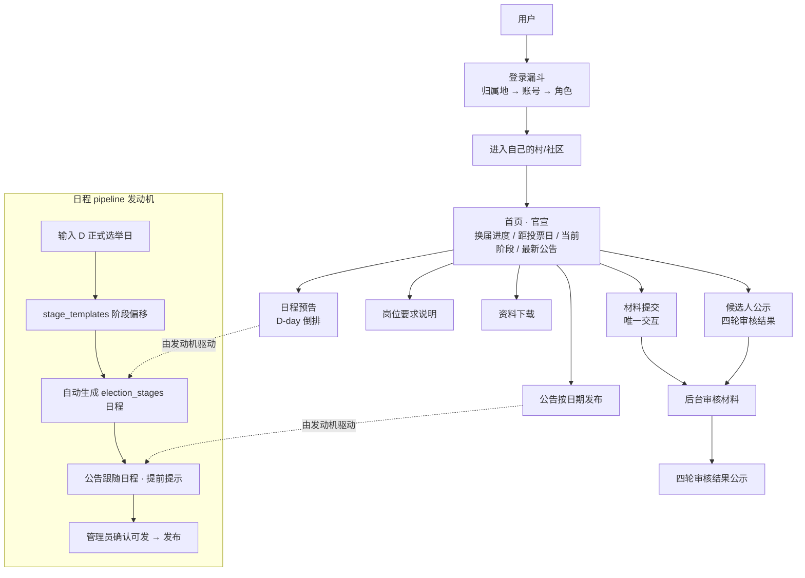
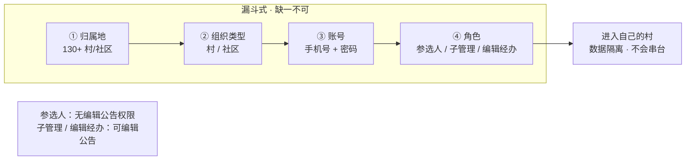
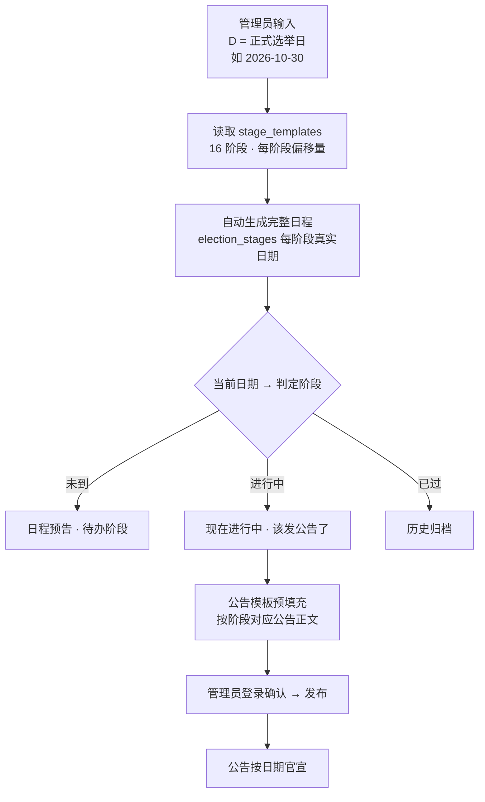
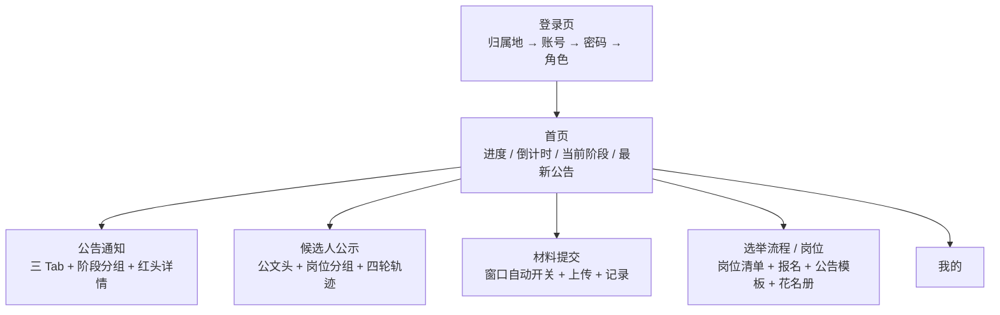
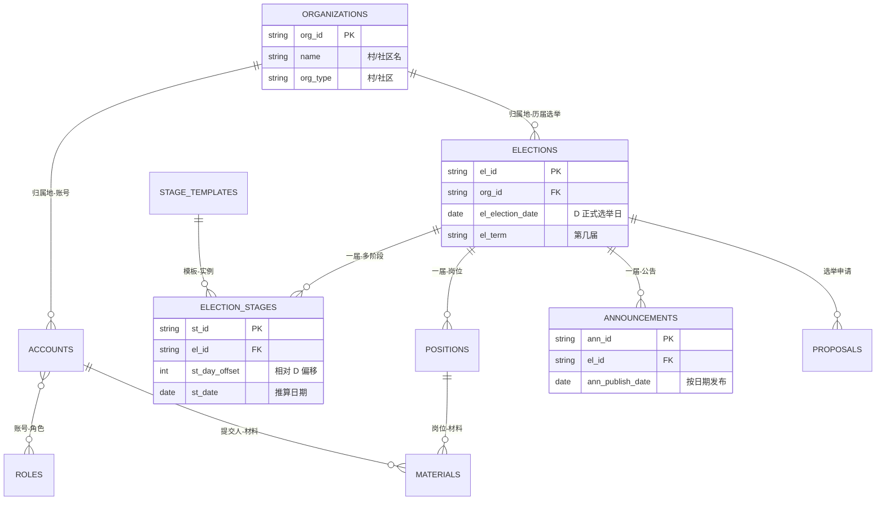

# 系统图 · Mermaid 全集

> 2026-08-31 · 村居换届选举系统（傻瓜式官宣平台）
> 配套：PRD-村居换届选举系统.md / 页面结构-小程序蓝本.md / 设计规范-青墨鎏金.md

---

## 1. 系统全景图（四条主线）

---

## 2. 登录漏斗（防串台）

---

## 3. 日程 pipeline 发动机（D-day 自动倒排）

---

## 4. 前端页面结构（小程序蓝本）

---

## 5. 数据表关系（ER）

---

> 变更树：2026-08-31 创建系统图全集（全景/漏斗/pipeline/页面/ER）
